# Milestone Project 4 - Cloudberry Clay  

# Table of Contents
1. [Project description](#project-description)
2. [User Experience (UX)](#user-experience-ux)
3. [Design Choices](#design-choices)
4. [Wireframes](#wireframes)
5. [Entity Relationship](#entity-relationship)
6. [Features](#features)
7. [Tools and Technologies](#tools-and-technologies)
8. [Testing](#testing)

## Project Description

Cloudberry Clay is a full-stack e-commerce website built for **Code Institute Portfolio Project 4**. It represents a fictional small-batch ceramics brand specialising in colourful, handmade clay art pieces such as vases, dishes, ring holders and other decorative homeware.

The site provides a complete online shopping experience including:
- A responsive front-end with a clean, pastel, creative brand identity  
- Full product catalogue featuring multiple categories  
- Individual product pages with detailed descriptions and images  
- A session-based shopping bag with update/remove functionality  
- Secure checkout using Stripe
- User accounts powered by Django Allauth
- Order history and saved delivery details  
- Admin CRUD management for products  
- AWS S3 hosting for images & static files  

The project is deployed on Heroku with a PostgreSQL database and uses Django to handle routing, authentication, product management, ordering logic, profile storage and secure transactions.

[Return to Table of Contents](#table-of-contents)

## User Experience (UX)
Cloudberry Clay has been designed as a warm, playful and inviting online shopping experience for users who appreciate handmade ceramic art. 

The UX process for this project follows the five planes of user experience:  
Strategy -> Scope -> Structure -> Skeleton -> Surface, ensuring decisions made during development were supported by clear user needs and business goals.

### Strategy Plane

Cloudberry Clay aims to connect users with a clay artist's handmade work in a simple, beautiful and trustworthy way. The primary purpose is to allow customers to browse, purchase, and return to view their orders with ease.

#### Business Goals

- Provide a visually appealing and professional online shop for a ceramics brand.  
- Enable easy product creation, editing and removal by the store owner.  
- Build trust through clear layouts, photography and secure payments.  
- Encourage return visits through user accounts and stored delivery info.

#### User Goals

- Browse products quickly and intuitively.  
- View high-quality images and detailed descriptions.  
- Easily manage a shopping bag and adjust quantities.  
- Complete a secure checkout process with Stripe.  
- Create and manage an account with order history.  

### Target Audience

Cloudberry Clay is designed for:
- People who enjoy handmade pottery and unique decorative items  
- Gift shoppers looking for something personal  
- Fans of soft pastel colour palettes and minimal but warm aesthetics  
- Customers familiar with small online craft shops  
- Younger audiences who appreciate Instagram/TikTok-style homeware  

### Personas

To ensure the site meets user needs, three personas were developed to represent typical Cloudberry Clay customers:

#### Persona 1 - Claudia, 24: Creative home stylist

**Goals:**  
- Find unique decor items for her bedroom and living space  
- Easily browse categories and see details of products
- Save time by storing her address for future orders

**Frustrations:**  
- Cluttered websites  
- Confusing checkout processes  
- Low-quality product photos

**How Cloudberry Clay supports Claudia:**  
- Clean product grid & pastel design  
- High-quality images on product pages  
- Saved profile details for quick checkout  

#### Persona 2 - Natalie, 32: Gift Buyer

**Goals:**  
- Purchase a special handmade gift  
- View product dimensions, price and quality clearly  
- Receive email confirmation and clear delivery info  

**Frustrations:**  
- Unclear product information  
- Complicated payment steps

**How Cloudberry Clay supports Natalie:**  
- Product descriptions  
- Clear delivery charge and thresholds  
- Secure, simple Stripe checkout with confirmation  

#### Persona 3 - Mark, 28: Small Business Supporter

**Goals:**  
- Support independent artists  
- Learn the story behind the brand  
- Purchase ethically-made items  

**Frustrations:**  
- Impersonal or overly corporate websites  

**How Cloudberry Clay supports Mark:**  
- Warm “About” page sharing story   
- Personalised brand tone and photography  
- Simple navigation and clear user journey  

### User Stories

User stories were developed to guide features and prioritise functionality using Agile methods. Please visit the GitHub project board [here.](https://github.com/users/naomihunt25/projects/9)

### **Owner Goals**

As a **store owner**, I want to:
- Add, edit, and delete products so I can maintain an accurate catalogue.  
- View orders through Django admin.  
- Ensure user ordering is smooth and secure.  
- Provide clear product information to reduce confusion.  

### **User Goals**

As a **site user**, I want to:
- View the homepage and understand what the store offers.  
- Browse all products quickly and filter them.  
- Click a product to view its full details.  
- Add items to a shopping bag.  
- Update or remove items from the bag.  
- View my bag total, delivery cost, and free delivery threshold.  
- Checkout securely with a card.  
- Create an account to save my details.  
- View and repeat past orders.  
- Log out securely.

### MoSCoW Prioritisation

#### **Must Have**
- Product browsing and detail pages  
- Shopping bag with update/remove  
- Stripe checkout and webhook  
- Order history  
- Profile with saved delivery info  
- Admin product CRUD  
- Responsive layout  

#### **Should Have**
- Toast messages for feedback  
- Custom error pages  
- Search bar  
- Product sorting  

#### **Could Have**
- Wishlist  
- Review system  
- Newsletter
- Multi-image product galleries  

#### **Won’t Have (for now)**
- Live stock levels  
- Gift cards  
- Subscription model  

### UX Structure

The site’s structure follows a clear hierarchy:
- Homepage introduces the brand  
- Navigation gives direct access to products, account, and bag  
- Product catalogue offers sorting and filtering  
- Product detail pages provide images and information  
- Bag & checkout maintain transparency and clarity  
- Profile page gathers all user information and orders  

### Skeleton Plane

Key wireframe decisions included:
- Clean card layouts for products  
- Clear, vertical checkout form structure  
- Prominent “Add to Bag” button  
- Consistent spacing and margins  
- Mobile-first considerations for small screens  

### Surface Plane

Cloudberry Clay’s final UI embraces:

- Pastel pink and blue accents  
- White backgrounds for clarity  
- Rounded UI elements  
- High-quality product imagery  
- Minimal text for readability  

The result is an aesthetically pleasing shopping experience that stays true to the handmade brand concept.

[Return to Table of Contents](#table-of-contents)

## Design Choices

Cloudberry Clay’s design reflects the brand’s focus on handmade ceramics and creative home décor. The aesthetic combines soft pastel tones, generous white space, and clean typographic choices to highlight product photography and create a welcoming shopping experience.

### Typography

- **Roboto Mono**  
  Ensures clarity and readability throughout the site, especially on product descriptionsa and checkout pages.

- **DM Serif Display**  
  Brings an elegant, artistic feel that suits the handcrafted ceramic theme. Its soft curves and high-contrast strokes create a boutique, studio-like atmosphere, giving the brand a refined but warm personality.

### Colour Palette

The colour scheme is based around soft pastel tones that support the brand’s warm and creative identity:

- **Pink (#FF95DE)**  
  Used for primary buttons, promotional highlights, and call-to-action elements. This adds a sense of charm and playfulness to the interface.

- **Blue (#7AA4FF)**  
  Used for secondary accents, category labels, and subtle UI elements. This introduces calmness and contrast without competing with product photography.

### Visual Style & Imagery

- **High-quality product photos** with clean, minimal backgrounds ensure the textures, shapes, and colours of each ceramic piece are clearly visible.  
- **Rounded buttons** and soft shadows echo the organic forms of handcrafted clay.  
- **Grid-based product layouts** create structure while allowing each item to stand out.  
- **Hero imagery** sets a warm, creative tone, instantly communicating the brand identity.  
- **Minimal UI clutter** keeps focus on the ceramics and improves user navigation.

### Accessibility & Responsiveness

- Font sizes, spacing, and contrasts were chosen to ensure readability across devices.  
- Interactive elements include clear hover states and feedback via toast messages.  
- Alt text is applied to product imagery for accessibility.  
- The layout adapts gracefully across desktop, tablet, and mobile screens.

[Return to Table of Contents](#table-of-contents)

## Wireframes

Wireframes were created during the planning stage to map out the structure and layout of each key page. The aim was to ensure a simple, intuitive shopping experience while keeping focus on product imagery and clear navigation. Below are the wireframes used to guide development.

### Home Page Wireframe

The homepage introduces the brand through a hero image, a short tagline, and clear navigation to products and categories. Featured items help guide users into the catalogue.

### Products Page Wireframe

The products page uses a grid layout to display all available items with filtering and sorting options.

### Product Detail Page Wireframe

This page shows a large product image, detailed description, price, quantity selector and the “Add to Bag” button. The aim is clarity and a strong visual focus on the ceramic piece.

### Shopping Bag Wireframe

The shopping bag displays item images, quantities, totals and options to update or remove items before checkout.

### Checkout Page Wireframe

The checkout form collects delivery details and integrates with Stripe for payment. The layout keeps everything simple and linear to reduce friction.

### Login / Signup Wireframes

These forms allow users to create an account or access existing profiles.
  

[Return to Table of Contents](#table-of-contents)

## Entity Relationship

During the planning phase, an Entity Relationship Diagram (ERD) was created to map out the database structure used in Cloudberry Clay. The ERD helps visualise how products, orders, users, and profiles relate to each other in the backend.

Cloudberry Clay uses a relational PostgreSQL database, managed through Django’s ORM. The structure consists of five core models:

### **Category**
- `name`  
- `friendly_name`  

Each product belongs to one category.

**Relationships:**  
- One category -> Many products

### **Product**
- `category` (ForeignKey to Category)  
- `name`  
- `description`  
- `price`  
- `sku`  
- `image` / `image_url`  
- `rating`  

Products represent individual clay items that can be viewed, added to the bag, and purchased.

**Relationships:**  
- One product -> Many order line items

### **UserProfile**
- Linked to Django’s built-in User model 
- Stores default delivery information  
- Stores saved details for returning shoppers  

**Relationships:**  
- One UserProfile -> Many orders

### **Order**
- `order_number`  
- `user_profile` 
- `full_name`, `email`, `phone_number`  
- `address` fields  
- `order_total`, `delivery_cost`, `grand_total`  
- `stripe_pid`, `original_bag`  

Orders are created during checkout and store all information required for order history and admin management.

**Relationships:**  
- One order -> many order line items  
- Many orders -> One UserProfile

### **OrderLineItem**
- `order` (ForeignKey to Order)  
- `product` (ForeignKey to Product)  
- `quantity`  
- `lineitem_total`  

This model allows orders to contain multiple products in varying quantities.

**Relationships:**  
- Many OrderLineItems -> One order  
- Many OrderLineItems -> One product

## ERD Diagram

Below is a diagram illustrating all relationships between the database models:

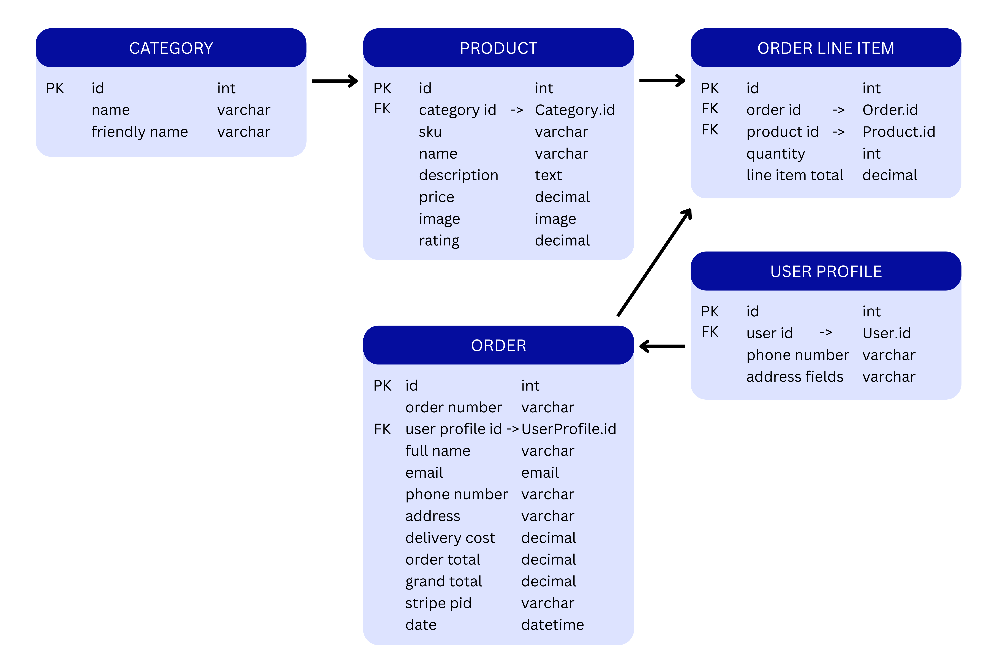

[Return to Table of Contents](#table-of-contents)

## Features

Cloudberry Clay includes a range of features that allow users to browse products, manage their shopping bag, complete secure purchases, and maintain personalised profiles. The site also provides administrative tools for managing products and orders through a secure interface.

### Home Page

- A clean hero section introducing the brand.  
- Clear navigation that directs users to browse all products or sign into their account.  
- Soft pastel design that reflects the artistic, handcrafted nature of the brand.

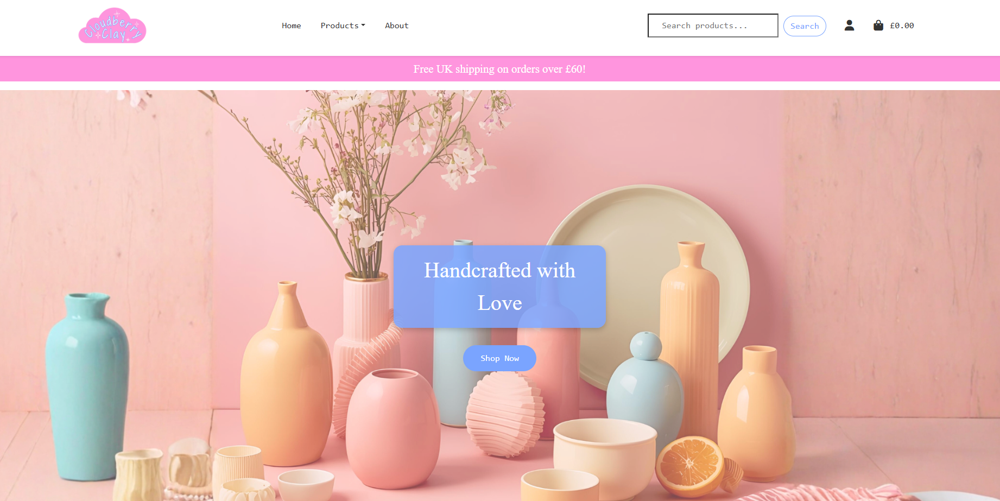

### Products Page

- Displays all products in a responsive grid layout.  
- Each product card includes an image, name, price, and link to the detail page.  
- Category filtering and sorting options are available.  
- Search bar allows users to find items quickly.

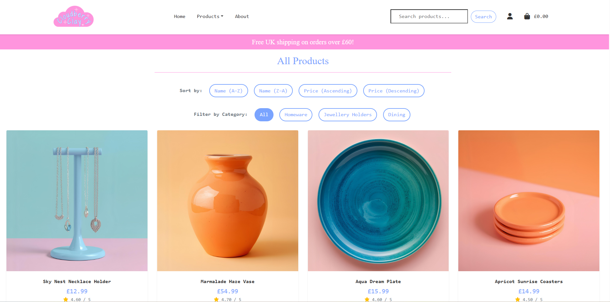

### Product Detail Page

- High-quality product image displayed prominently.  
- Accessible product information including name, description, price, rating and category.  
- Quantity selector for adding items to the bag.  
- Subtle design elements and colour accents to match brand identity.

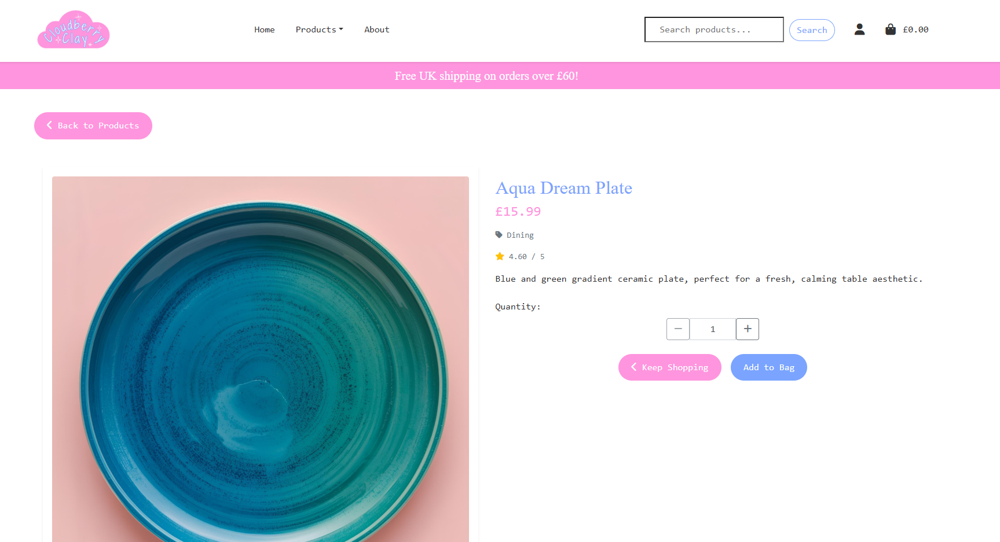

### Shopping Bag

- Displays selected products, item quantities, prices, and subtotals.  
- Users can update quantities or remove items from their bag.  
- Clear breakdown of delivery cost and free-delivery thresholds.  
- Toast messages provide real-time feedback for actions.

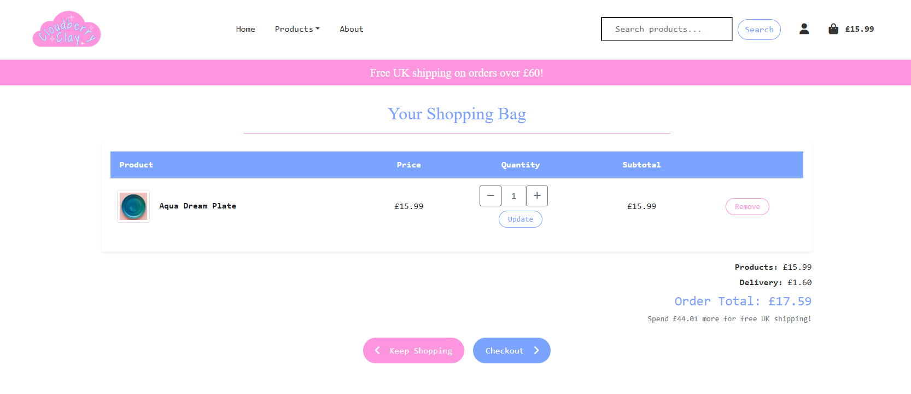

### Checkout Page

- Secure checkout using Stripe’s PaymentIntent.  
- Form collects delivery details and displays an order summary.  
- Inline card payment field using Stripe Elements.  
- Automatic calculation of delivery cost and totals.  
- Errors are clearly handled with messages.

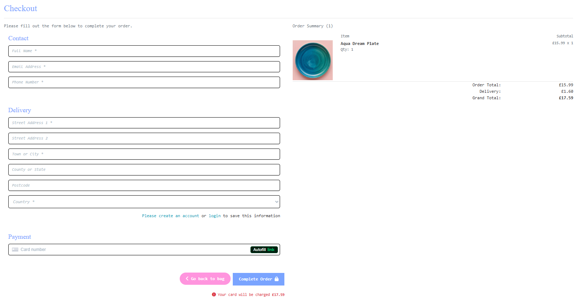

### Checkout Success Page

- Displays full order summary and order number.  
- Confirms successful payment and details stored in user profile (if logged in).  

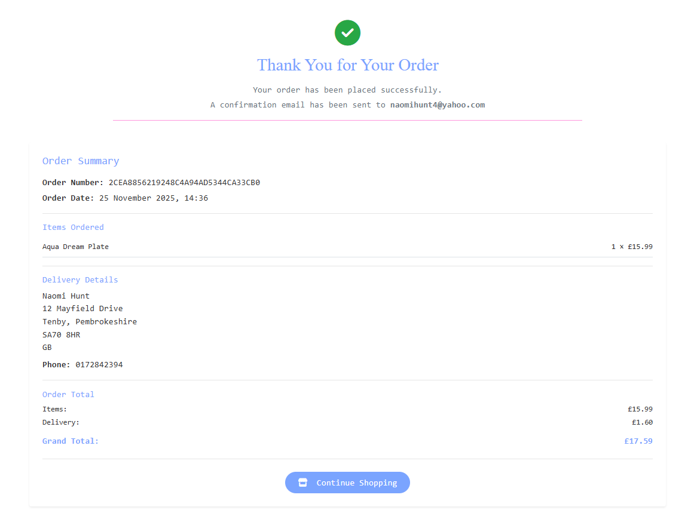

### User Account Features

#### Sign up and Sign in
- Users can create an account, log in, log out, and reset passwords using Django Allauth.  
- Error handling and feedback messages guide users smoothly.

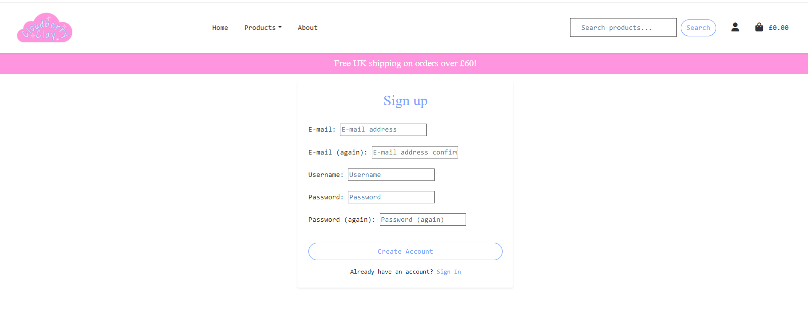
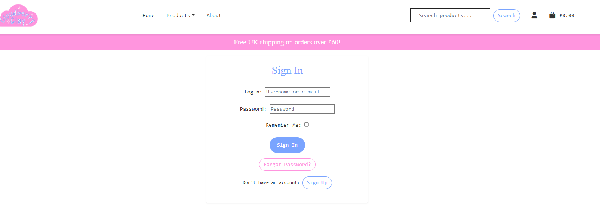

#### User Profile
- Displays saved delivery details.  
- Users can update their default information for faster future checkouts.  
- Lists past orders with links to detailed receipts.  
- Clean, simple layout for easy navigation.

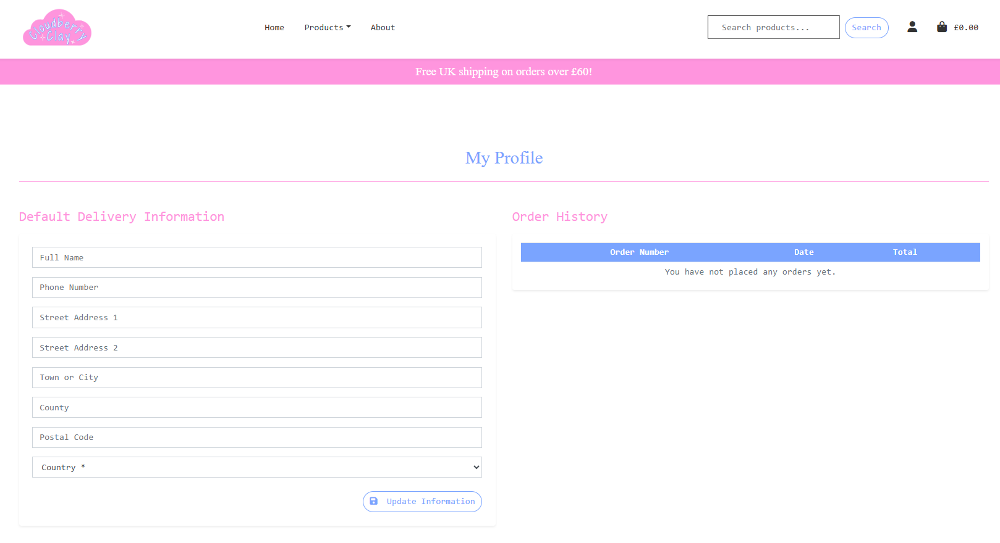

### Admin Features (Superuser Only)

- Add new products through a dedicated admin form.  
- Edit existing products with pre-populated forms.  
- Delete products with confirmation prompts.  
- Easy content management without requiring database access.

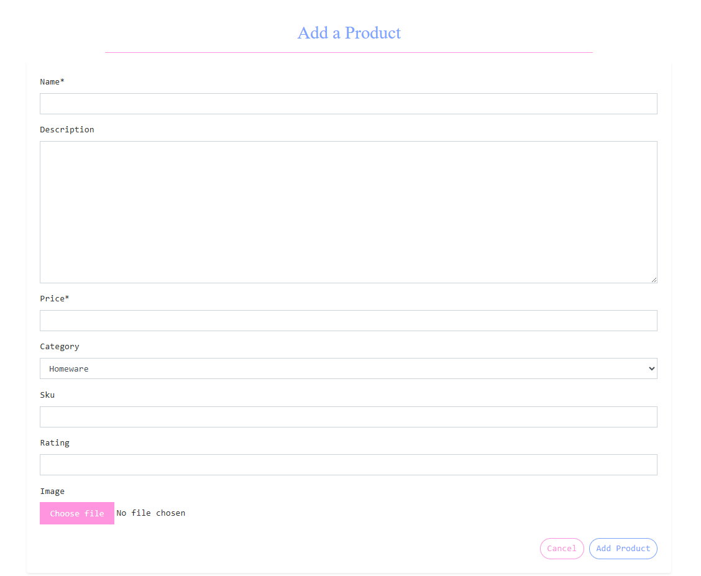

### Error Pages

- 400 Page: Displayed when the server cannot process the user’s request.
- 403 Page: Shown when a user attempts to access a restricted page.
- 404 Page: Custom design to redirect users if a page doesn’t exist.  
- 500 Page: Friendly fallback page for server errors.

The error pages maintain brand style and provide helpful navigation options.

Example:  

### Future Features

- Wishlist/favourites system  
- Product reviews
- Newsletter signup  
- Multi-image product gallery  
- Discount codes and promotional pricing  
- Recently viewed items  

These enhancements will continue to improve user engagement and overall shopping experience.

[Return to Table of Contents](#table-of-contents)

## Tools and Technologies

Cloudberry Clay was built using a range of modern technologies to deliver a secure, responsive, and user-friendly e-commerce experience. Below are the core tools, frameworks, and services used throughout development.

### Languages

- HTML5 - Structure and semantic layout of pages.  
- CSS3 - Styling, branding, layout, and responsive design.  
- JavaScript - Small interactive elements and Stripe integration.  
- Python - Backend logic, models, and business functionality via Django.

### Frameworks and Libraries

- Django - Full-stack web framework powering routing, models, admin, and authentication.  
- Django Allauth - User registration, login, logout, and email authentication.  
- Stripe - Secure card payments using PaymentIntent and webhooks.  
- Bootstrap 5 - Provides responsive layout components and grid system.  
- Crispy Forms - Enhances Django form rendering to improve usability.

### Database and Storage

- PostgreSQL - Relational database used in production (via Heroku).  
- SQLite3 - Default database used during local development.  
- AWS S3 (Amazon Web Services) - Storage for static and media files in production.  
- Heroku Postgres - Hosted database instance connected to the deployed app.

### Development Tools

- Git - Version control for tracking and managing code changes.  
- GitHub - Remote repository hosting and project board for user stories.  
- VS Code - Cloud-based or local development environments.  
- Chrome DevTools - Debugging layout issues, testing responsiveness, and inspecting elements.

### Design and Documentation Tools

- Balsamiq - Created wireframes for planning page layouts.  
- Canva - Designed mockups, hero image, product images and diagram assets.  
- Favicon.io - Generated the site’s favicon.
- Google Fonts - Fonts used from Google Fonts directory.

### Deployment and Hosting Tools

- Heroku - Hosting platform for the live web application.  
- Gunicorn - WSGI HTTP server used in production.  
- Whitenoise - Serving static files efficiently on Heroku.  
- dj-database-url - Securely configures database URLs via environment variables.

### Python Packages 
- asgiref  
- dj-database-url
- gunicorn 
- Pillow - Required for handling product images.  
- psycopg2/psycopg2-binary - PostgreSQL adapter for Python.  
- stripe - Payment processing.  
- whitenoise - Static file compression and caching.

Full list of installed packages can be found in `requirements.txt`.

[Return to Table of Contents](#table-of-contents)

## Testing
Please refer to the  file, for all testing documentation.

