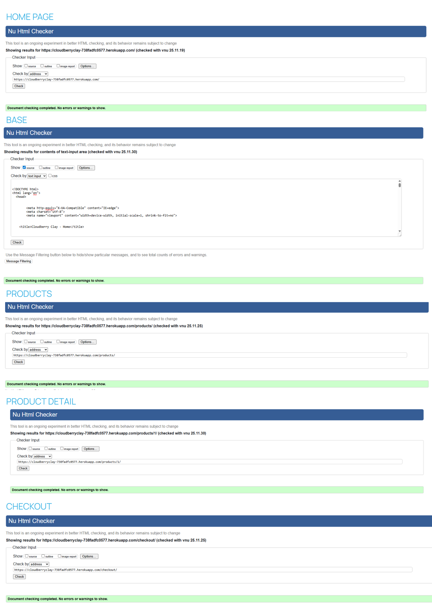
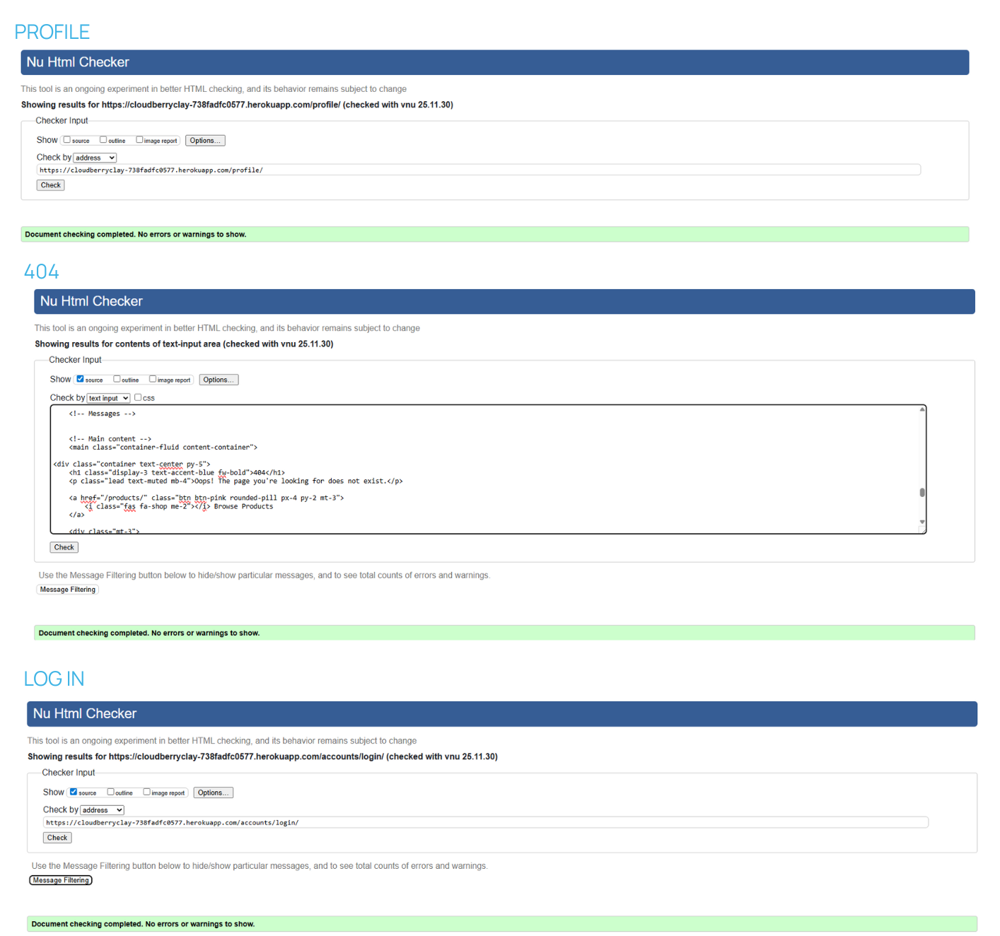
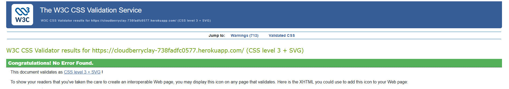
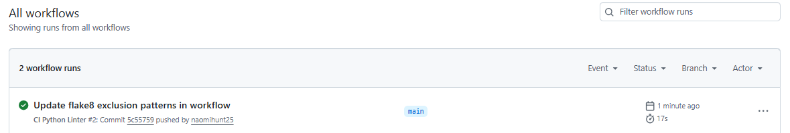
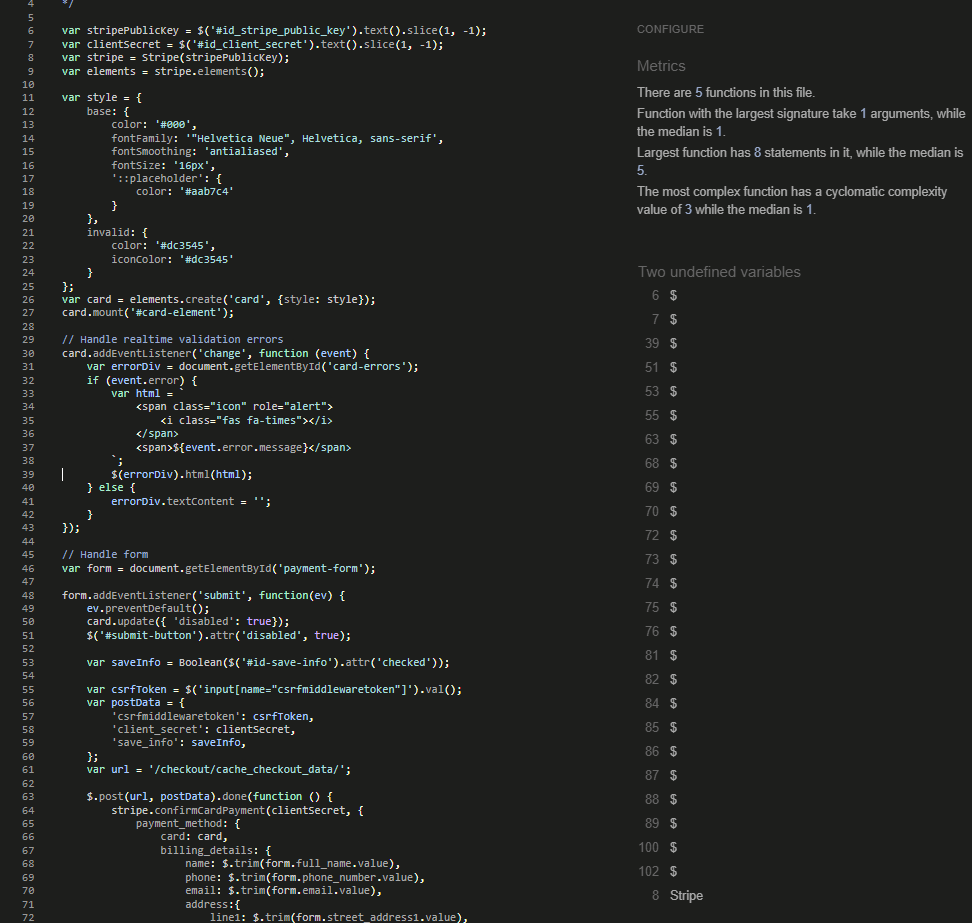

# Testing

This document details all testing carried out on Cloudberry Clay, including manual testing, validation, cross-browser checks, Stripe payment testing, user story verification and debugging completed during development.

## Table of Contents

# 1. Testing Overview

Testing was carried out throughout development using:
- Manual testing in the browser  
- DevTools for layout and mobile inspection  
- Stripe test mode for secure checkout simulation  
- Django debug tools and console logs  
- W3C validators  
- Lighthouse for accessibility and performance  
- Responsive design checks on multiple devices  

No automated unit tests were included due to project scope, but extensive manual testing was performed.

# 2. Manual Feature Testing

Each feature was tested to ensure it behaves correctly and provides the expected user experience.

## Home Page

| Test | Expected Result | Pass |
|------|----------------|--------|
| Hero loads correctly | Background image and CTA visible | ✔ |
| Nav links work | All links redirect to correct pages | ✔ |
| Responsive layout | Text and images scale correctly | ✔ |
| CTA buttons | Navigate to product catalogue | ✔ |

## Products Page

| Test | Expected Result | Pass |
|------|----------------|--------|
| Product grid loads | All products visible with images | ✔ |
| Category filters | Filter updates product list | ✔ |
| Sorting options | Sort changes product order | ✔ |
| Search bar | Returns relevant results | ✔ |
| Clicking product | Opens product detail page | ✔ |

## Product Detail Page

| Test | Expected Result | Pass |
|------|----------------|--------|
| Image loads | Full-size product image visible | ✔ |
| Add to bag | Adds correct item/quantity | ✔ |
| Quantity validation | Cannot go below 1 | ✔ |
| Toast messages | Confirm item was added | ✔ |

## Shopping Bag

| Test | Expected Result | Pass |
|------|----------------|--------|
| Update quantity | Adjusts totals correctly | ✔ |
| Remove item | Removes item from bag | ✔ |
| Delivery threshold | Updates dynamically | ✔ |
| Bag total | Calculates correctly | ✔ |

## Checkout Page

| Test | Expected Result | Pass |
|------|----------------|--------|
| Form validation | Required fields enforced | ✔ |
| Stripe card element | Renders without errors | ✔ |
| Payment submission | Proceeds to confirmation | ✔ |
| Order saved | Visible in admin & user profile | ✔ |

## User Profile

| Test | Expected Result | Pass |
|------|----------------|--------|
| View saved details | Displays default delivery information | ✔ |
| Update details | Saves info successfully | ✔ |
| View order history | Shows list of past orders | ✔ |
| View order detail | Displays receipt | ✔ |

## Admin (Superuser Only)

| Test | Expected Result | Pass |
|------|----------------|--------|
| Add product | Saves new item | ✔ |
| Edit product | Updates correctly | ✔ |
| Delete product | Removes from database | ✔ |
| Access control | Hidden from normal users | ✔ |

# 3. User Story Testing

Below shows how each user story was satisfied.

| User Story | Requirement | Outcome |
|------------|-------------|---------|
| Browse products | View grid of items | ✔ |
| View details | See product info | ✔ |
| Add to bag | Add/adjust quantity | ✔ |
| Manage account | Register/login/logout | ✔ |
| Checkout securely | Stripe payment | ✔ |
| View order history | Past orders | ✔ |
| Admin CRUD | Manage products | ✔ |

# 4. Form and Authentication Testing

## Registration
- Correct input -> account created  
- Weak password -> error shown  
- Email already exists -> error displayed  
- Allauth templates render correctly  

## Login
- Correct credentials -> login successful  
- Incorrect password -> error message  
- Logout redirects user  

## Profile Form
- Missing fields -> validation prevents submission  
- Saved detail autofills checkout  

All authentication tests passed.

# 5. Shopping Bag and Checkout Testing

### Bag Tests
- Adding items updates totals  
- Removing items updates totals  
- Adjusting qty updates totals  
- Messages appear correctly  

### Checkout Tests
- Missing fields = error  
- Invalid card = Stripe error  
- Successful payment = redirect to success page  
- Order saved to database  

All tests passed successfully.

# 6. Stripe Payment Testing

Stripe test mode was used with the official test cards.

| Scenario | Test Card | Expected Result | Pass |
|----------|-----------|-----------------|--------|
| Successful payment | `4242 4242 4242 4242` | Payment succeeds | ✔ |
| Declined card | `4000 0000 0000 0002` | Stripe shows decline error | ✔ |
| Insufficient funds | `4000 0000 0000 9995` | Declined | ✔ |
| Expired card | `4000 0000 0000 0069` | Error shown | ✔ |
| Incorrect CVC | `4000 0000 0000 0101` | Error shown | ✔ |

Webhook also successfully validated payments after checkout.

# 7. Responsiveness and Browser Testing

Tested using Chrome DevTools, physical devices and online testing tools.

### Devices Tested On:
- iPhone 12  
- iPhone SE  
- iPad Mini  
- Samsung Galaxy S20  
- Chrome Laptop  
- MacBook Air  
- Surface Pro  

### Browsers Tested On:
- Chrome v142
- Safari v26
- Firefox v145
- Edge v140

| Page | Mobile | Tablet | Desktop |
|------|--------|--------|---------|
| Home | ✔ | ✔ | ✔ |
| Products | ✔ | ✔ | ✔ |
| Product Detail | ✔ | ✔ | ✔ |
| Bag | ✔ | ✔ | ✔ |
| Checkout | ✔ | ✔ | ✔ |
| Profile | ✔ | ✔ | ✔ |

All layouts worked without major issues.

# 8. Performance and Accessibility

### Lighthouse Results

# 9. Code Validation

### HTML
Passed W3C Validator using the W3C Markup Validation Service.

### CSS
Passed W3C Validator using the CSS Jigsaw Validator.

### Python
All custom Python files were validated using the Code Institute PEP8 Linter through 'Actions' on Github. A GitHub workflow was set up to automatically run flake8 on every push.

### JavaScript
The project contains one custom JavaScript file used for Stripe payment integration: stripe_elements.js

This file was tested using the JSHint online validator. No major issues were returned after resolving one minor missing semicolon. Warnings about undefined variables are expected because these are provided by external libraries and not defined within the script.

